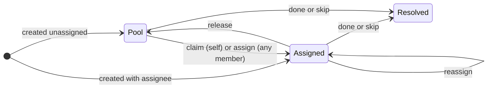
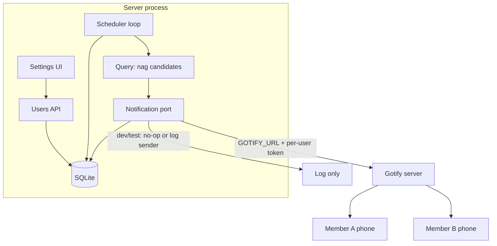

# Tow MVP Epic — Foundations, Household, Notifications (P0 + P1 + P3)

## Context

The product brief defines the minimum viable product (MVP) as roadmap
milestones P0 + P1 + P3: "the app is not the product until the first nag
fires." This Epic covers exactly that scope. P4 (fuzzy due windows,
quota-based recurrence), roles, and the `priority` surface-or-drop decision
stay out of scope. One constraint crosses the boundary: the P3 nag-timing
design must not preclude fuzzy due windows later, because "start nagging on X,
escalate toward Y" is the shape fuzzy windows will take.

The verified current state is in `docs/roadmap.md` ("Where We Are"). The
product principles that bound every milestone are in
`docs/product-brief.md`: the instance is the household, permissions are flat,
assignment has exactly two paths (direct assign or self-claim), the unassigned
pool is an inbox, and the right to interrupt is earned by assignment.

### Pre-Epic prerequisites

Already done by the user before this Epic starts:

- Documentation restructure committed (`5b3236d`).
- `old_app/` deleted; `chores.dev.db` untracked and `*.db` git-ignored.

Remaining, small, and assignable before or during early P0:

- Trim or annotate `GOOGLE_CLIENT_SECRET` and `PUBLIC_URL` in `.env.example`.
  Both are verified unread by any code, config, or CI file. The sign-in flow
  verifies a Google identity token against Google's public keys and never
  performs a server-side code exchange, so the client secret has no consumer.
- Optional but recommended: make CI run `deno task ci`. Today an image can be
  published from a commit that does not type check.
- Operations, needed by the time P3 starts, not before: a reachable Gotify
  instance (a temporary local instance is fine for development; the production
  server returns later), one Gotify account per household member, and a
  persistent volume for the SQLite file in the k8s deployment. Once migrations
  exist, the database file is the precious artifact (see ADR 0006).
- Decisions to have ready by P1: the `ALLOWED_EMAILS` values and the
  household timezone.

The dead `.ts` twins are deliberately **not** deleted up front. They are
diverged drafts of the TypeScript conversion and may hold useful work. The
conversion rung reconciles them file by file.

## Objective

Deliver the Tow MVP as three ordered milestones. Each milestone is a rung,
not a release; none is shippable on its own, and later milestones assume
earlier ones have landed.

- **P0 — Foundations.** Convert all application source to TypeScript (ADR
  0002, scheduled by this Epic). Establish the migration mechanism (ADR 0006).
  Make completion transactional and un-completion non-lossy, and record the
  due date each completion closed out. Rename the product to Tow.
- **P1 — Household.** Persist users on login behind an env-var allowlist.
  Split `chores.user_id` into creator plus a nullable `assignee_id`; drop
  owner-scoped visibility and ownership checks. Ship assign, claim, and
  release as first-class actions; edit and delete UI; and a "what's next"
  landing view with the board and pool as deliberate second views.
- **P3 — Notifications.** Stand up the notification subsystem: a notification
  port with a Gotify adapter, per-user application tokens, an in-process nag
  scheduler for assigned chores, skip as a first-class resolution, and the
  age-keyed pool nudge with at most one server-configured due-date blast.

Cross-cutting constraints every milestone must respect:

- The technology strategy does not change: Astro server-side rendering (SSR)
  on Deno, SolidJS islands, UnoCSS, hand-written SQL through `node:sqlite`,
  Google Sign-In with a self-issued session JSON Web Token (JWT). New code
  follows the existing patterns recorded in `docs/systemPatterns.md`.
- Single-process, single-writer deployment. The scheduler, the startup
  migrations, and SQLite all assume one replica.
- Settled product principles are invariants: flat permissions, two assignment
  paths, the pool as an inbox, push only for assigned work, and the
  neutral-framing rule — the app reports state about chores, never verdicts
  about people. Nothing in this Epic may introduce scorekeeping, streaks, or
  per-person comparisons.

References: ADR 0002 (TypeScript, conversion scheduled here), ADR 0003
(migrations stay hand-written SQL), ADR 0004 (session flow preserved), ADR
0005 (amended by P0's resolution transaction), ADR 0006 (new, this Epic).

## Vertical Slice Findings

Traced and verified against source, not docs:

- **Auth path.** `login.astro` uses the Google Identity Services ID-token
  flow; `src/utils/auth.js` verifies against Google's public JSON Web Key Set
  and checks issuer and audience; the login route mints a 30-day HS256 session
  cookie; `src/middleware.js` resolves `locals.user` and owns the redirects.
  No code inserts a `users` row — the second-user foreign-key failure is real.
  The allowlist gate belongs in the login route, after token verification and
  before upsert and session minting.
- **Completion path.** `PUT /api/chores/[id]` runs spawn-successor, write-log,
  and update-row as three separate statements, and clears `recurrence` from
  the completed row. Un-completing restores nothing: the spawned occurrence
  stays and the chore silently stops recurring. There is no link between a
  completed row and its spawned successor, so reversal needs a new column.
- **Schema bootstrap.** DDL lives twice — `src/utils/db.js` and
  `scripts/setup_db.js` — under `CREATE TABLE IF NOT EXISTS`, which cannot
  alter an existing database. `scripts` is excluded from type checking, so the
  duplication drifts silently.
- **UI data flow.** The page queries the database in frontmatter and passes
  rows to islands as props; islands never re-fetch. `ChoreModal` posts a
  native form and relies on a 302 to reload; `ChoreItem` does an optimistic
  `fetch` PUT with rollback. New views and actions must pick one of these two
  established channels per interaction rather than inventing a third.
- **Unused fields and old ownership confirmed.** `priority`,
  `remind_until_done`, and `notification_sent_at` are written by nobody today.
  P3 activates `remind_until_done` as the per-chore nag escape hatch and
  replaces the single timestamp with per-occurrence, per-recipient delivery
  tracking. `priority` stays deferred. Separately, `GET /api/chores` and the
  page filter `WHERE user_id = ?`, while `PUT`/`DELETE` enforce a 403 ownership
  check; those owner-scoped behaviors disappear in P1.

## Milestone Architecture

### P0 — Foundations

Rung order matters inside this milestone: TypeScript conversion first, so all
schema and notification code is born typed; then the migration mechanism; then
the resolution transaction; the rename can slot anywhere.

**TypeScript conversion (ADR 0002, now scheduled).** Convert every source
file to `.ts`/`.tsx`, including tests. Reconcile each dead `.ts` twin against
its running `.js` counterpart per file: the `.js` file is behavioral truth,
but the twin may carry usable type drafts. Define the shared domain types —
the chore row, the completion log row, the session user payload — in one
module and use them at every boundary that reads a database row. Type
`Astro.locals.user` in `src/env.d.ts`. Reconcile the JSX settings drift
between `deno.json` (`react-jsx`) and `tsconfig.json` (`preserve`). Remove
`checkJs` only when no `.js` application source remains.

**Migration mechanism (ADR 0006).** Numbered, forward-only TypeScript
migration modules contain hand-written SQL and are imported by a static
registry, so Astro includes them in the production bundle. A
`schema_migrations` ledger records applied versions. The server applies pending
migrations before it accepts requests. Migration 0001 is the baseline of the
current schema. The `CREATE TABLE IF NOT EXISTS` bootstrap leaves `db.js`; the
duplicated DDL leaves `scripts/setup_db.js`, which keeps only seed data. Fresh
and existing databases converge through the same chain, including when the
built container starts against a mounted SQLite file.

**Resolution transaction (amends ADR 0005).** The occurrence state becomes an
explicit `chores.status` value (`open` | `completed` | `skipped`); P0 uses the
first two and reserves `skipped` for P3.
The old `done` boolean stops being authority. The resolve-flow — change status,
spawn successor, and write log — becomes one idempotent SQLite transaction.
These schema additions ride the first migrations:

- `completion_logs.due_at`: the due date of the occurrence being closed. This
  is the lateness diagnostic the product brief asks for; from this migration
  forward, every completion silently accumulates the evidence of whether the
  nag works.
- `chores.recurrence_parent_id`: a nullable self-reference set on a spawned
  successor, pointing at the occurrence that spawned it.
- `chores.revision`: starts at zero and increments on each edit or state
  mutation. It proves whether a spawned successor is still untouched.

Un-completion becomes one transaction with safe, explicit semantics. It can
restore the recurrence rule, delete the completion log, and delete the direct
successor only when that successor is still `open` at revision zero. If the
successor was edited, resolved, or already spawned later work, the request is
rejected with a conflict response and changes nothing. Repeated complete and
un-complete requests are idempotent. The invariant a child can assert: there is
never more than one open occurrence for a recurrence chain, and that occurrence
carries the recurrence rule. The implementing change amends ADR 0005 in the
same commit.

**Rename to Tow.** `public/manifest.json` (`name`, `short_name`,
`theme_color` kept in sync with `uno.config.js`), `src/layouts/Layout.astro`,
`src/pages/login.astro`, `src/pages/index.astro` header copy ("Tow",
subtitle "STEADY HOUSEHOLD MANAGEMENT" per `docs/system-design.md`), the
README, and the icon assets — `docs/icon.png` / `docs/icon1.png` are the
candidate sources for regenerating the `public/` favicon and touch-icon sizes.
The same change closes the "Product name" entry under _Open Language
Questions_ in `docs/domain-language.md`, because that answer only becomes true
when the code says Tow.

### P1 — Household

**User provisioning.** The login route upserts the `users` row when a Google
token verifies (`id` = Google `sub`, plus email and display name — a migration
adds `users.name`). This defuses the foreign-key failure that blocks every
second real user. The session JWT flow is unchanged.

**Login gate.** An `ALLOWED_EMAILS` env var (comma-separated, case-insensitive
match) is checked after Google verification and before upsert and session
minting. A rejected account gets 401, no cookie, and no `users` row. The
`ENABLE_AUTH=false` mock-user bypass is untouched. Recommended: the middleware
re-checks the token's email against the allowlist on each request, so removing
an email takes effect promptly instead of at token expiry — session tokens are
self-contained and cannot be revoked (ADR 0004).

**Assignment model.** A migration adds `chores.assignee_id` (nullable,
references `users(id)`) and `chores.unassigned_since`. `NULL` is the pool;
`unassigned_since` records when the chore most recently entered the pool, so
pool age is not confused with creation age after release or reassignment.
`user_id` keeps only its creator meaning. New chores default to the creator as
assignee, which makes the product brief's one-person path nag-eligible without
extra work; the create/edit surface also offers an explicit Pool choice and any
member as a direct assignee. The state machine:

`Resolved` is written here as done or skipped; skip itself arrives in P3, and
P1's resolution is done only. Completed occurrences stay resolved history per
ADR 0005.

**Visibility and permissions.** The `WHERE user_id = ?` filter leaves the page
query and `GET /api/chores`; the 403 ownership checks leave `PUT`/`DELETE`.
Any member can see, edit, delete, complete, assign, or claim anything. A new
members read endpoint (id, name, picture) feeds the assignment picker; it is
available to signed-in members only.

**Assignment actions.** Claim, assign, release, and reassign are first-class
mutations on the chore resource. The exact endpoint shape (fields on the
existing PUT versus dedicated action routes) is a slicing-time decision; the
Epic fixes the transitions and their invariants, not the URL.

**Views.** Three views over the same household data:

- **What's next (default landing):** my assigned open chores due today,
  bucketed in the household timezone, falling back to the nearest upcoming due
  date when nothing is due today.
- **Board:** every household chore; the client-side Fuse search lives here.
- **Pool:** the unassigned inbox, framed as ambient pressure — visible, never
  pushed.

A `HOUSEHOLD_TZ` env var (IANA name, default UTC) anchors "due today"
bucketing now and nag timing in P3. `due_date` stays stored as UTC ISO strings;
the timezone only affects bucketing, display, and trigger time. The create/edit
surface must accept a direct due date and time — including a one-off chore due
in an hour — because the product brief's smallest complete experience depends
on it. The SSR shell plus props-as-channel pattern continues; the island set is
restructured around the three views, and the modal is rewritten for create
**and** edit, with delete on the item or in the modal.

Before assignment and settings mutations ship, the P1 surface must restore
cross-site request forgery (CSRF) protection: re-enable Astro origin checking
or provide an equivalent request token for every browser mutation. Native form
posting can change during the modal rewrite; `security.checkOrigin: false`
must not remain the system-wide trust policy. The implementing change adds the
new terms (Assignee, Pool, Claim, Member) to `docs/domain-language.md`.

### P3 — Notifications

The differentiator. The subsystem shape is fixed here; the nag cadence and
escalation policy are deliberately left to a design round when this milestone
starts (per the roadmap), and that round records its decisions in an ADR.

**Notification port.** One application-owned module owns "send a message to a
member." The Gotify specifics — server URL, per-user application token,
message format `TOW: <title>` per `docs/system-design.md` — live in one
adapter behind it. A no-op or log-only sender serves development, tests, and
any run without `GOTIFY_URL` configured. This seam exists because the sending
behavior genuinely varies by environment; it is not a test hook.

**Configuration and trust boundary.** `GOTIFY_URL` is a server env var. Each
member stores their own Gotify application token (migration adds
`users.gotify_token`, nullable). A null token means that member has not opted
into push — the secondary user may never opt in, and that is a supported state,
per the product brief. A minimal settings surface binds writes to
`locals.user.id` and lets a member set, replace, or clear **their own** token.
No API returns a stored token; member-list responses expose only configured/not
configured state. Logs and errors redact tokens and Gotify credentials. HTTPS
is required outside an explicit local-development mode. P1's CSRF protection
covers this surface before token writes are enabled.

**Scheduler and delivery ownership.** An in-process interval loop is initialized
exactly once by an explicit production server-start hook, after migrations and
before readiness. Its lifecycle owner prevents duplicate loops during
hot-module reload, cancels the timer on shutdown, and exposes a bounded `tick`
operation for tests. Deployment stays at one replica — SQLite's single writer
already forces this, and the scheduler inherits the assumption.

A `notification_deliveries` outbox replaces `notification_sent_at` and owns
delivery intent. Each row identifies chore occurrence, recipient user,
notification kind (assigned nag or pool blast), and policy slot, with a unique
constraint plus attempt/sent timestamps. The recipient row resolves its current
`users.gotify_token` only at send time, so token rotation does not rewrite chore
history. A tick first creates eligible delivery slots idempotently, then sends
pending slots through the port. This gives restart-safe at-least-once delivery
and tells the scheduler exactly when each member was last notified for each
chore. It cannot promise exactly-once external delivery: a process can crash
after Gotify accepts a message but before SQLite records success, so that rare
case can duplicate a message. Unreachable Gotify or an invalid token is isolated
per delivery, logged without secrets, and retried without blocking requests or
other members. The unused `chores.notification_sent_at` column is removed.

**Nag policy (design round at milestone start).** What this Epic fixes:
assignment makes an `open` chore nag-eligible and `remind_until_done` defaults
to true. The chore editor exposes it as the per-task escape hatch. Turning it
off cancels unsent nag slots and stops creation of new slots for that chore;
turning it back on resumes from the next eligible policy slot and does not
replay suppressed slots.
A nag also stops when status becomes `completed` or `skipped`. The delivery
outbox is scheduling authority. What the design round still decides: cadence,
escalation steps, and quiet hours if any. The round must produce timing in the
shape "start nagging on X, escalate toward Y" so P4's fuzzy due windows can
layer on without redesign.

**Skip.** A first-class resolution that rides P0's resolution transaction: the
occurrence status becomes `skipped`, the nag stops, a recurring chore spawns
its next occurrence in the same transaction, and the log records the
resolution. `completion_logs` gains a `resolution` column (`completed` |
`skipped`); the table keeps its name. Every list, landing, recurrence, and
scheduler query treats only `status = 'open'` as active. Skip exists because a
reminder you can only silence by falsely claiming "done" is a broken reminder —
and a skip is itself diagnostic data. The implementing change adds Skip to
`docs/domain-language.md`.

**Pool nudge.** The pool's health signal is **age, not due date**: the fuzzy,
collaborative items the pool exists to hold are the least likely to carry a due
date. Age is calculated from `unassigned_since`, which resets each time a chore
enters the pool. Ambient pressure is in-app only. On top of that, at most one
**policy slot** for a server-configured due-date blast is created per pool item
and recipient. The outbox records each recipient separately, so one failed send
does not suppress another member's blast; the same rare crash window as any
Gotify send can still create an external duplicate.

## Files to Modify

Grouped by milestone; areas, not exhaustive lists. Slicing happens later.

**P0**

- `src/**/*.js`, `src/**/*.jsx`, test files — converted to `.ts`/`.tsx`; dead
  twins reconciled per file; `checkJs` removed at the end.
- `src/env.d.ts` — `Astro.locals.user` typed.
- `deno.json`, `tsconfig.json` — JSX settings reconciled.
- `src/utils/db.*` — DDL bootstrap removed; migrations applied at startup.
- New statically registered TypeScript migration modules — baseline,
  `due_at`, explicit chore `status`, `recurrence_parent_id`, and `revision`.
- `scripts/setup_db.js` — DDL removed; seed data only.
- `src/pages/api/chores/[id].*` — completion and un-completion become single
  transactions; `due_at` written; successor link maintained.
- `public/manifest.json`, `public/` icons, `src/layouts/Layout.astro`,
  `src/pages/login.astro`, `src/pages/index.astro`, `README.md` — Tow rename.
- `docs/domain-language.md` — "Product name" open question closed (same
  change as the rename).
- `docs/adr/0005-*.md` — amended by the resolution transaction change.
- `.env.example`, `.github/workflows/docker-publish.yml` — dead vars trimmed
  or annotated; optional `deno task ci` gate.

**P1**

- `src/pages/api/auth/login.*` — allowlist gate plus user upsert.
- `src/middleware.*` — optional allowlist re-check per request.
- Migrations — `users.name`, `chores.assignee_id`,
  `chores.unassigned_since`.
- `src/pages/index.astro`, `GET /api/chores` — owner filter dropped; landing
  view query (assigned to me, due-today bucketing, nearest-due fallback).
- `src/pages/api/chores/[id].*` — 403 checks removed; assignment mutations.
- New members read endpoint.
- `src/components/*` — modal rewrite (create + edit + delete, direct due
  date/time, assignee or Pool); landing, board, and pool views; assignment
  picker; search moves to the board.
- `astro.config.js` and browser mutation handling — restore origin or token
  based CSRF protection before shared and secret-bearing mutations ship.
- `docs/domain-language.md` — Assignee, Pool, Claim, Member added (same
  change as the feature).

**P3**

- New notification module (port + Gotify adapter + no-op sender) and scheduler
  module, wired into server startup.
- Migrations — `users.gotify_token`, `completion_logs.resolution`, the
  per-recipient `notification_deliveries` outbox, removal of
  `chores.notification_sent_at`, and `remind_until_done` default/backfill to
  true for assigned open chores.
- `src/pages/api/chores/[id].*` — skip resolution.
- Settings surface (page or modal) plus users API extension for own-token
  management; chore editor gets the default-on per-task nag toggle.
- Board and pool views — unclaimed-age presentation.
- `.env.example`, deployment docs — `GOTIFY_URL`, pool-blast settings,
  `HOUSEHOLD_TZ`, persistent-volume note.
- `docs/domain-language.md` — Skip added (same change as the feature).
- New ADR from the nag-policy design round.

## Reuse Opportunities

- `src/utils/scheduleUtils.js` (`calculateNextOccurrence`) — reused as-is for
  skip-spawn and recurrence edits; converted to TypeScript in P0.
- Content negotiation in `POST /api/chores` (form → 302 redirect, JSON →
  JSON) — the pattern for any new mutation route; the E2E suite depends on the
  JSON form.
- Optimistic update with rollback in `ChoreItem` — the pattern for claim,
  skip, and done toggles.
- Client-side Fuse search — stays client-side; moves to the board view.
- `jose` session machinery and the middleware gate — unchanged; the allowlist
  slots into the login route without touching session verification.
- `node:sqlite` prepared-statement style — migrations and all new queries
  follow it (ADR 0003). `DatabaseSync` is synchronous, so wrapping the
  resolution flow in `BEGIN`/`COMMIT` is safe.
- `ENABLE_AUTH=false` mock user and the `DB_ENV=test` database split — the
  harness for scheduler and notification tests with the no-op sender.
- `docs/icon.png`, `docs/icon1.png` — source art for the rename's icon sizes.

## Verification Plan

- **Automated:** `deno task ci` (lint, format, type check, unit/integration
  tests) green at every milestone boundary; `deno task test:e2e` green, with
  new specs for the second-user flow, assignment, direct due times,
  edit/delete, and — against a local Gotify test instance — nag and skip. P0
  must also establish `deno task test:production-lifecycle`: build the actual
  production image, start it once with a fresh mounted SQLite file and once
  with a pre-migration fixture, and prove migrations finish before readiness.
  P3 extends that lifecycle check to prove the production start hook creates
  exactly one scheduler and recovers pending delivery rows after restart.
- **Manual:** the product brief's smallest complete experience, end to end on
  two accounts: primary user sees their day, adds a chore, gets nagged until
  it is done or skipped; the partner sees the pool and claims from it.

### Outcome Evidence

What must be observably true when each milestone is real — concrete enough
that a child Plan can turn each line into a command that is red before the
work and green after.

**P0**

- No `.js`/`.jsx` application source remains under `src/` or `tests/` (config
  files excepted); `deno.json` no longer sets `checkJs`; `deno task ci` is
  green.
- `src/utils/db.*` contains no `CREATE TABLE` statement; a
  `schema_migrations` table exists; a fresh database and an upgraded database
  reach the identical schema through statically bundled migrations alone;
  `scripts/setup_db.js` contains no DDL. The built production container passes
  both lifecycle cases before readiness.
- The resolve-flow's status change, spawn, and log execute in one transaction —
  a forced failure mid-flow leaves no partial state. Repeated requests are
  idempotent. Un-completing an untouched chain leaves exactly one open
  occurrence carrying the recurrence rule; trying to rewind a touched or
  advanced successor returns conflict and changes no rows.
- `chores.status`, not the old `done` boolean, is the source of truth for open
  versus completed occurrences; all server list and recurrence queries use it.
- Every `completion_logs` row written after the migration has a non-null
  `due_at` when the closed occurrence had a due date.
- The manifest, layout, login page, and README say "Tow"; the installed PWA
  shows the Tow name and icon; the "Product name" open question is gone from
  `docs/domain-language.md`.

**P1**

- A second Google account (allowlisted) can sign in and create a chore — the
  foreign-key failure is gone. Every successful login has a matching `users`
  row with a display name.
- A non-allowlisted Google account receives 401, no session cookie, and no
  `users` row. `ENABLE_AUTH=false` still serves the mock user.
- `WHERE user_id = ?` appears in no list query; `GET /api/chores` returns
  every household chore to any member. The string `403` appears in no
  ownership check — any member can edit, delete, or complete any chore.
- `chores.assignee_id` exists; claim, assign, release, and reassign
  transitions work through the API and follow the state machine above.
- The modal edits and deletes, not only creates.
- The create/edit surface accepts a one-off due date and time and defaults a
  new chore to its creator, with explicit Pool and member choices.
- The default route shows the signed-in member's assigned chores due today
  (household-timezone bucketing) with the nearest-due fallback; board and pool
  are reachable as deliberate second views; search works on the board.
- Browser mutation requests fail when they lack valid same-origin or CSRF-token
  evidence; `security.checkOrigin: false` is no longer the system-wide policy.

**P3**

- A member can store, replace, and clear their own Gotify token through the
  UI; another member cannot read it.
- The built production server initializes exactly one scheduler after
  migrations and before readiness; hot reload does not create a second loop,
  and shutdown cancels it.
- An assigned, `open`, past-due chore with `remind_until_done = true` creates
  one delivery row for each eligible policy slot and produces a
  `TOW: <title>` Gotify message. New chores default the field to true. Turning
  it off cancels unsent slots and creates no later slots; turning it back on
  resumes without replay. The
  nag also stops when status becomes `completed` or `skipped`. Restart recovers
  pending rows without creating a second logical slot; the documented external
  guarantee is at-least-once, including the rare possible duplicate after a
  send/commit crash.
- Skip sets `status = 'skipped'`; a recurring skip spawns the next occurrence
  in one transaction; the log row records `resolution = 'skipped'` and the
  `due_at` it closed. No list, landing, or scheduler query treats it as open.
- The pool view shows age from `unassigned_since`; pool exit and re-entry reset
  that value. One outbox slot exists per item, recipient, and configured blast;
  one member's failure does not suppress another's delivery.
- With no `GOTIFY_URL` configured, the app runs normally and notification
  attempts are logged, not sent; the full test suite passes without a Gotify
  server.

**Protected across the whole Epic** — must still be true when every child has
landed:

- Google ID-token sign-in with the self-issued 30-day session cookie and the
  middleware redirect rules (ADR 0004).
- The mock-user development bypass and Playwright's ability to run without a
  Google account.
- The one-row-per-occurrence recurrence model (ADR 0005) — resolved
  occurrences retain their own due date and title unless a member explicitly
  deletes the chore under the existing flat delete capability.
- Client-side fuzzy search; the form-versus-JSON content negotiation the E2E
  suite uses; SSR with props-as-channel islands; hand-written SQL with no
  query builder; `deno task ci` as the gate.

**Expected to stop existing:**

- Owner-scoped visibility and the 403 ownership checks.
- The add-only modal and the absence of delete, skip, assign, and claim UI.
- The `CREATE TABLE IF NOT EXISTS` bootstrap and the `setup_db.js` DDL
  duplication.
- JavaScript application source and the dead `.ts` twins.
- The "Chores App" name.
- The `done` boolean as occurrence authority; `status` replaces it.
- Dead notification state: `remind_until_done` becomes a default-on, editable
  per-chore policy; `notification_sent_at` is removed and replaced by
  per-chore-occurrence, per-recipient delivery rows; the production `users`
  table stops being empty.

## Edge Cases & Considerations

- **Un-complete against a touched successor.** If the direct successor is no
  longer open at revision zero, un-completion returns conflict and changes
  nothing. This protects the one-open-occurrence invariant and is documented
  in the amended ADR 0005.
- **Failed migration at startup.** The server must refuse to start (ADR
  0006). Recovery is restore-from-backup plus fix-forward; the persistent
  volume and a pre-deploy file copy are the mitigation. Make the volume real
  before the first migration ships.
- **Single replica assumption.** Scheduler, startup migrations, and SQLite
  all assume one writer. Keep the deployment at one replica and say so in the
  deployment docs.
- **Allowlist versus live sessions.** The gate at login cannot revoke an
  existing 30-day token. The recommended middleware re-check makes de-listing
  effective promptly; if slicing drops it, record the accepted limitation.
- **Gotify failure modes and guarantee.** Unreachable server, invalid or
  rotated token: per-delivery isolation, redacted log, retry a pending outbox
  row, never crash request serving, never block other members' sends. Delivery
  is at-least-once, not exactly-once; a crash after Gotify accepts but before
  SQLite commits can duplicate one message.
- **Scheduler lifecycle.** Production startup owns one loop after migration;
  development hot reload is guarded; shutdown cancels it. Source-level `tick`
  tests are not sufficient — the built-container lifecycle test proves wiring.
- **Notification secrets.** Token writes are bound to the session user; stored
  tokens never appear in member reads, API responses, or logs. HTTPS is required
  outside explicit local development.
- **Timezone.** One `HOUSEHOLD_TZ` for the whole instance; per-user timezones
  are out of scope. Nag timing and due-today bucketing share it.
- **CSRF boundary.** `security.checkOrigin: false` is acceptable only in the
  verified current native-form path. P1 must replace it with Astro origin
  checking or an equivalent CSRF token before assignment and notification-token
  mutations ship.
- **List growth.** Completed occurrence rows accumulate without bound (ADR
  0005 consequence). Acceptable for the MVP; an archive or pruning policy is a
  later decision.
- **P4 non-preclusion.** The nag-policy design round must express timing as
  "start on X, escalate toward Y" so fuzzy due windows layer on without
  redesign. Quota recurrence remains a separate, harder concept with its own
  future design round.
- **`priority`.** The column stays, still unused; surface-or-drop is
  explicitly deferred.
- **Glossary updates ride with the code.** Each term (Tow, Assignee, Pool,
  Claim, Member, Skip) enters `docs/domain-language.md` in the same child that
  makes it true — never before, never in this Epic.
