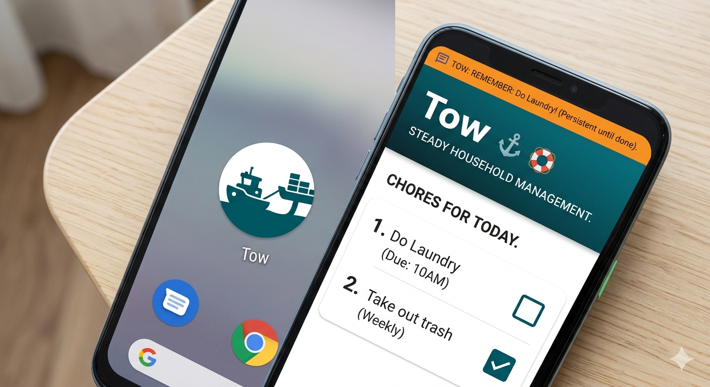

# Product Context

## Why This Project Exists

- This project is a "Chore App" or chore management application focused on
  household Chores with constant reminders for chores until marked as done in
  the app. The distinctive feature will be constant notifications. The users
  will be notified continusly until they mark the chore as done.

## Problems It Solves

- Helps users organize, assign and track household chores.
- The reminders keep happening constantly until the chore is marked as done or
  skipped. Helps people with ADHD complete chores on time.

## How It Should Work

- Users must sign in with their Google account to use the app.
- Users can view a list of their chores.
- Users can add new chores with titles, descriptions, priorities, due dates, and
  recurrence rules.
- Users can mark chores as complete.
- Users can delete chores.
- Chores may have descriptions.
- Chores may have due dates and potentially recurring schedules.
- Due dates can be long periods like a week or month. e.g. every June you need
  to plan the Kids birthday party. Or the first week of each month you have to
  check the budget.
- Chores are sorted (likely by due date or completion status).
- The app will send notifications using gotify to remind users of their chores.

## User Experience Goals

The app needs to be user friendly, with a strong focus on mobile usability. The
focus should be on the chores that are due today (or this week, month depending
on the schedule)

This document details the purpose and goals of the project from a product
perspective. It should align with the `projectbrief.md`.

## Branding

- Primary color: #005F6A
- Accent: #FFBF00
- Background: #FFFFFF
- Main text: #1f2937
- Muted text: #6b7280

The image features two main views of your app:

The Icon (Left): This is the crucial nautical reimagining. It's the circular icon (/android-chrome-192x192.png) you need for the Android home screen. It uses a strong, friendly deep teal background. The central graphic is a stylized tugboat—a powerful symbol of steady, persistent pulling. The rope attaching it to the hypothetical "chore" forms a subtle, hidden "T" shape for "Tow."

The App UI (Right): The nautical theme is integrated throughout the interface, not just the logo:

Header: The background uses your specified #005f6a deep teal. The app name "Tow" is prominent, with the subtitle "STEADY HOUSEHOLD MANAGEMENT." The little anchor next to the logo helps reinforce the theme.

Chores List: A clean, mobile-first design focused on "Chores For Today."

Nautical Details:

Icons: Instead of boring checkboxes, tasks can use stylized icons like a life preserver for "Laundry" or an anchor for critical, grounding tasks (like "Check Budget").

Gotify Notifications: Crucially, a bright orange "Gotify" notification banner is shown at the top of the interface, demonstrating the core feature: "TOW: REMEMBER: Do Laundry! (Persistent until done)."

