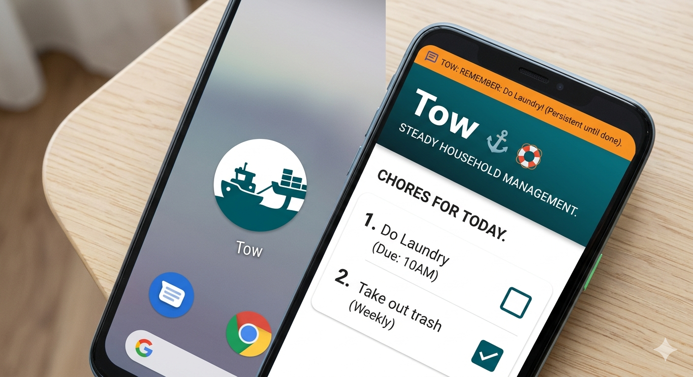

# System Design

TODO: expand on this

## User Experience Goals

The app needs to be friendly and positive, with a strong focus on mobile
usability. The focus should be on the chores that are due today (or this week,
month depending on the schedule)

This document details the purpose and goals of the project from a product
perspective. It should align with the [product brief](product-brief.md).

## Branding

**The product is Tow, with a marine theme.** Settled 2026-08-10. The rename is
tracked as a P0 item in the [roadmap](roadmap.md); the product rationale is in
[product-brief.md](product-brief.md#identity).

A tugboat pulls something that will not move on its own, steadily, until it
arrives. That is the persistent-reminder mechanic as an image rather than a
feature list, which is why the name fits.

### Palette

- Primary: #005F6A (deep teal)
- Accent: #FFBF00 (amber)
- Background: #FFFFFF
- Main text: #1f2937
- Muted text: #6b7280

### Marks

The icon is circular, for the Android home screen — a stylized tugboat on deep
teal. The rope attaching it to the towed object forms a hidden "T."

### How far the theme goes

The theme lives in the **surface**: name, icon, palette, illustration, and the
tone of copy. It does **not** rename domain concepts. A chore is a Chore, done
is Done, due is Due — no "cargo," "moored," or "adrift." The app's value depends
on a glanceable list the user trusts without translating it, so warmth belongs
in the copy and plainness in the nouns.

Within that boundary:

- **Header:** deep teal, app name "Tow," subtitle "STEADY HOUSEHOLD MANAGEMENT."
- **Chore list:** mobile-first, focused on what is due today.
- **Category icons** may be thematic where they aid recognition — a life
  preserver for laundry, an anchor for grounding tasks — as decoration on plain
  labels, never as a replacement for them.
- **Notifications:** the Gotify message leads with `TOW:` so the source is
  recognizable on a lock screen, e.g. `TOW: Do Laundry` — persistent until
  resolved.

