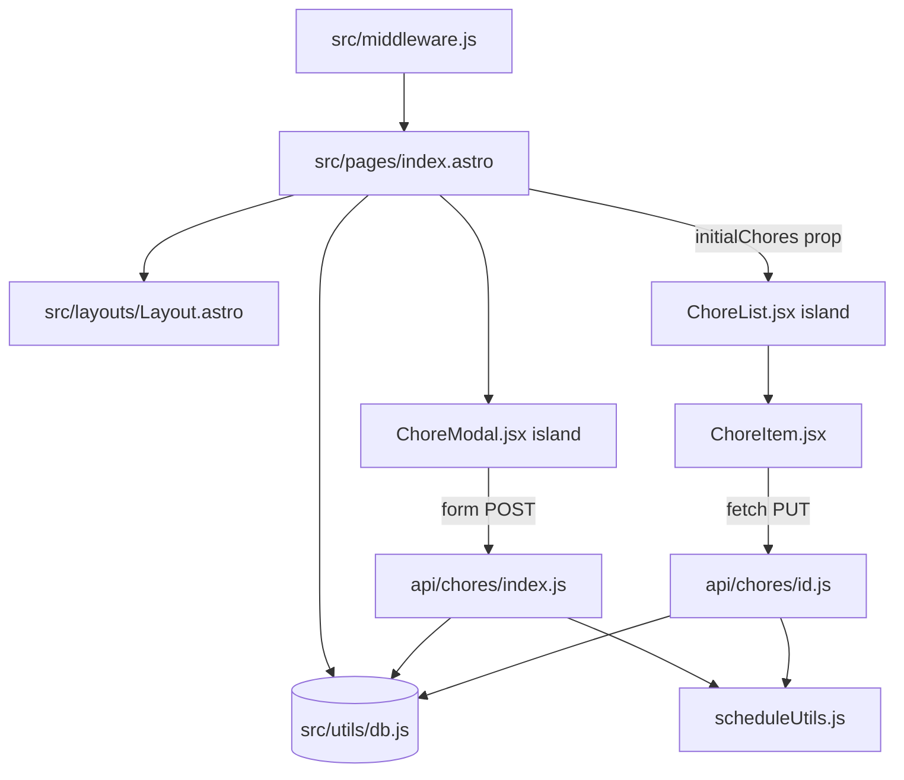

# System Patterns

This document records the patterns the code uses today. The decisions behind
those patterns, and their trade-offs, are in the architectural decision records:

- [ADR 0001](adr/0001-astro-ssr-on-deno-with-solidjs-islands.md) — Astro
  server-side rendering on Deno with SolidJS islands
- [ADR 0002](adr/0002-typescript-instead-of-javascript-with-jsdoc.md) —
  TypeScript instead of JavaScript with JSDoc types (accepted, not yet
  implemented; the source is still JavaScript)
- [ADR 0003](adr/0003-sqlite-through-node-sqlite-without-a-query-builder.md) —
  SQLite through `node:sqlite` without a query builder
- [ADR 0004](adr/0004-google-sign-in-with-a-self-issued-session-jwt.md) — Google
  Sign-In verified once, then a self-issued session cookie
- [ADR 0005](adr/0005-recurring-chores-spawn-a-new-row-on-completion.md) — A
  recurring chore spawns a new chore row when it is completed

## Design Patterns in Use

- **Server-rendered shell with interactive islands.** `src/pages/index.astro`
  queries the database in its frontmatter and renders the page. It mounts two
  SolidJS islands with `client:load`: `ChoreModal` in the header, and
  `ChoreList` in the main area. Everything else is static HTML.

- **Props as the only server-to-client channel.** The page passes the chore rows
  to `ChoreList` as the `initialChores` prop. There is no client-side store and
  no fetch on mount. The islands never re-query for the list.

- **Local signal state per island.** Each island holds its own state with
  `createSignal`. `ChoreList` holds the search query; `ChoreItem` holds
  `isDone`, `isLoading`, and `error`; `ChoreModal` holds `isOpen` and the form
  field values. The islands do not share state with each other. A change in one
  is invisible to the other until the page reloads.

- **Derived state with `createMemo`.** `ChoreList` computes the filtered list
  from the search query with `createMemo`. An empty query returns
  `props.initialChores` unchanged; otherwise the memo returns the Fuse.js
  results mapped back to their items.

- **Fuzzy search built in the component.** `ChoreList` constructs the `Fuse`
  instance inline over the `title` and `description` keys with `threshold: 0.3`.
  There is no separate search utility module.

- **Optimistic update with rollback.** `ChoreItem.handleToggle` sets the new
  done state before the request, sends `PUT /api/chores/:id`, and then
  re-applies the state from the server response. On failure it restores the
  previous state and shows an inline error. The button is disabled while the
  request is in flight.

- **Native form POST with a server redirect.** `ChoreModal` renders a real
  `<form method="post" action="/api/chores">`. The client-side `onSubmit`
  handler only calls `preventDefault` when the title is empty. On success the
  API route responds with a 302 redirect to `/`, so the browser reloads the page
  and the new chore appears in the server-rendered list. This is why creating a
  chore needs no client-side list update.

- **Content negotiation in one API route.** `POST /api/chores` inspects the
  `content-type` header. A form encoding produces a redirect response, including
  on error (`/?error=...`). A JSON body produces a JSON response with a status
  code. The same handler serves both the modal and programmatic callers such as
  the end-to-end tests.

- **Ownership check on every mutation.** `PUT` and `DELETE` in
  `src/pages/api/chores/[id].js` load the chore first, return 404 when it is
  missing, and 403 when `chore.user_id` does not match `locals.user.id`. The
  lookup is by id alone, so the ownership check is what enforces isolation.

- **JSON column parsed at every boundary.** `chores.recurrence` is stored as a
  JSON string. Each place that reads a chore row — the Astro page,
  `GET /api/chores`, and both handlers in `[id].js` — parses it inside a `try`
  block and ignores a parse failure. The parsing is repeated rather than shared.

- **Conditional rendering.** `ChoreModal` uses SolidJS `<Show>` for the modal
  body. `ChoreList` and `ChoreItem` use ordinary JSX ternaries and `&&` for
  empty states, optional descriptions, due dates, and recurrence badges.

- **List rendering with `.map()`.** `ChoreList` renders items with
  `filteredChores().map(...)`, not with the SolidJS `<For>` component. There is
  no keyed reconciliation, so the whole list re-creates on each change of the
  memo.

- **Single shared database handle.** Every server module imports the default
  export of `src/utils/db.js`, which is one `DatabaseSync` connection created at
  module load. Queries are hand-written SQL through `db.prepare(...)` with bound
  parameters.

- **Environment flags read directly from Deno.** The code calls `Deno.env.get()`
  at the point of use, with feature-specific flags (`ENABLE_AUTH`,
  `COOKIE_SECURE`, `DB_ENV`, `SESSION_SECRET`, `GOOGLE_CLIENT_ID`). There is no
  central configuration module and no generic "mode". The boolean flags compare
  against the exact string `false`, so any other value, including a missing
  value, selects the safe behavior.

## Component Relationships

The arrows are the only paths that exist. `ChoreList` and `ChoreModal` are
siblings with no connection between them, and `ChoreModal` reaches the server
through a browser form navigation rather than through `fetch`.

- **`src/middleware.js`** — runs before every request. Resolves
  `context.locals.user` and applies the login redirects.
- **`src/pages/index.astro`** — reads `Astro.locals.user`, queries the chores
  for that user ordered by `due_date`, parses each `recurrence` value, and
  renders. When there is no user it renders a "please log in" message instead of
  the list.
- **`src/layouts/Layout.astro`** — the HTML shell: UnoCSS reset, favicons, the
  web app manifest link, the theme color, the header, and the footer. It takes
  no props.
- **`ChoreList.jsx`** — the search input and the list. Owns the search query and
  the filtered memo. Renders one `ChoreItem` per chore and an empty-state row,
  with different text for "no results" and "no chores".
- **`ChoreItem.jsx`** — one row: the toggle button, the title, the optional
  description, the optional due date, and a recurrence badge.
  `getRRuleFrequency` reads the `FREQ=` part of the rule with a regular
  expression for the badge label. It accepts an optional `onUpdate` callback,
  which no caller passes today.
- **`ChoreModal.jsx`** — the "New Chore" button and the add-chore dialog.
  Fields: title (required), description, and a recurrence `<select>` with four
  fixed options (none, `FREQ=DAILY`, `FREQ=WEEKLY`, `FREQ=MONTHLY`). It creates
  only; it does not edit or delete.
- **`src/utils/auth.js`** — `verifyGoogleToken`, `createSession`, `getSession`,
  and the `UserPayload` typedef.
- **`src/utils/db.js`** — opens the SQLite file chosen by `DB_ENV`, enables
  foreign keys, creates the tables if they do not exist, and exports the
  connection.
- **`src/utils/scheduleUtils.js`** — exports one function,
  `calculateNextOccurrence(rruleString, lastCompletedDate)`. It parses the rule
  with `rrulestr`, anchors it with `dtstart`, and returns the first occurrence
  strictly after the start date, or `null` when the rule is invalid or has
  ended.

## Critical Implementation Paths

### 1. Authentication on every request

1. `src/middleware.js` intercepts the request.
2. If `ENABLE_AUTH` is the string `false`, it sets a fixed mock user on
   `context.locals.user` and skips verification.
3. Otherwise it reads the `session` cookie and calls `getSession`, which
   verifies the HS256 signature with `SESSION_SECRET`. An invalid or missing
   token gives `null`.
4. An unauthenticated request to anything other than `/login`,
   `/api/auth/login`, or `/api/auth/logout` redirects to `/login`.
5. An authenticated request to `/login` redirects to `/`.

### 2. Signing in

1. `/login` renders the Google Identity Services button with `GOOGLE_CLIENT_ID`.
2. The inline callback posts the Google credential to `POST /api/auth/login`.
3. The route verifies the credential against Google's key set, signs a 30-day
   session JWT, and sets the `session` cookie as `httpOnly`, `sameSite=lax`, and
   `secure` unless `COOKIE_SECURE=false`.
4. The browser navigates to `/`. `GET /api/auth/logout` deletes the cookie and
   returns to `/login`.

### 3. Viewing and searching chores

1. The Astro page fetches the user's chores on the server and passes them to
   `ChoreList` as `initialChores`.
2. `ChoreList` builds the Fuse index from that array.
3. Typing updates the `searchQuery` signal; the `createMemo` recomputes and the
   list re-renders.
4. Search and filtering never call the server. The list changes only when the
   page reloads.

### 4. Adding a chore

1. The user opens `ChoreModal` and fills in title, description, and recurrence.
2. The form posts as `application/x-www-form-urlencoded` to `/api/chores`.
3. The route reads `formData`, rejects a missing title with a redirect to
   `/?error=Title+is+required`, computes the first due date with
   `calculateNextOccurrence` when a rule was chosen, and rejects an unparsable
   rule with `/?error=Invalid+RRULE`.
4. It inserts the chore with a `crypto.randomUUID()` id, `done = 0`, and
   `recurrence` as `{"rrule": "..."}` JSON.
5. It redirects to `/` and the reloaded page shows the chore.

A JSON `POST` to the same route takes the same path but responds `201` with the
created chore. The end-to-end tests use this form.

### 5. Marking a chore done or not done

1. `ChoreItem` flips its local `isDone` signal and sends `PUT /api/chores/:id`
   with `{ done: <boolean> }`.
2. The route checks existence and ownership.
3. When `done` is true and the chore has a recurrence rule, it inserts the next
   occurrence as a new chore row, clears the rule from the current row, and
   keeps the current due date. See
   [ADR 0005](adr/0005-recurring-chores-spawn-a-new-row-on-completion.md).
4. When `done` is true it also inserts a `completion_logs` row, whether or not
   the chore recurs.
5. It updates the chore, re-reads it, and returns it. `ChoreItem` re-applies
   `done` from that response, so a server correction wins over the optimistic
   value.
6. A failed request restores the previous state and shows "Failed to update" in
   the row.

The new occurrence is not visible until the page reloads, because `ChoreList`
renders the array it was given at render time.

### 6. Deleting a chore

`DELETE /api/chores/:id` checks existence and ownership and then deletes the
row. `completion_logs` rows cascade with the chore. **No user interface calls
this route.** Only the end-to-end tests use it, for cleanup.

## Verification

- `deno task ci` — lint, format check, type check (`deno check`), and unit
  tests.
- `deno task test:e2e` — Playwright against the running Deno server.
  `tests/e2e/core-journey.spec.js` covers create, list, and complete through the
  API. `tests/e2e/recurrence.spec.js` drives the toggle in the browser for
  daily, weekly, and monthly rules.
- Unit tests: `src/utils/auth.test.js`, `src/utils/scheduleUtils.test.js`,
  `src/pages/api/chores/chores.test.js`.

## Not implemented yet

These appear in the product documents but no code implements them. Do not treat
them as patterns.

- **Push notifications (Gotify).** No client, no scheduler, no sender. The
  `remind_until_done` and `notification_sent_at` columns exist and are never
  written.
- **Offline support.** `public/manifest.json` and the manifest link make the app
  installable, but there is no service worker, so the app does not work offline.
- **Editing a chore.** `ChoreModal` creates only. The `PUT` route accepts
  `title`, `description`, and `rrule`, but no screen sends them.
- **Priority.** The `priority` column exists; nothing reads or writes it.
- **Chore assignment between people.** Every chore belongs to the user who
  created it.
